# EED Tool Decision Tree

## Complete EED Assessment Decision Flow

```mermaid
graph TD
    Start([Start EED Assessment]) --> InputCPV[Enter CPV Code]
    
    InputCPV --> LookupCPV[Lookup CPV Description]
    
    LookupCPV --> SelectOrg{Select Organization Type}
    
    SelectOrg -->|Government| GovPath[Government Organization]
    SelectOrg -->|Other| OtherPath[Other Organization]
    
    %% Other Organization Path
    OtherPath --> IsTendering{Is this a<br/>Tendering Organization?}
    
    IsTendering -->|No| CheckSubsidy{More than 50%<br/>Subsidized?}
    IsTendering -->|Yes| WrittenAgreement
    
    CheckSubsidy -->|No| NoEED[❌ No EED Requirements]
    CheckSubsidy -->|Yes| WrittenAgreement
    
    %% Government Path
    GovPath --> WrittenAgreement{Written Agreement<br/>Exists?}
    
    WrittenAgreement -->|No| NoEED
    WrittenAgreement -->|Yes| CounterPerf{Counter Performance<br/>Required?}
    
    CounterPerf -->|No| NoEED
    CounterPerf -->|Money Payment| LegalEnforce
    CounterPerf -->|Tax Benefit| LegalEnforce
    CounterPerf -->|In-Kind| LegalEnforce
    CounterPerf -->|Other| LegalEnforce
    
    LegalEnforce{Legally<br/>Enforceable?} -->|No| NoEED
    LegalEnforce -->|Yes| EconInterest
    
    EconInterest{Economic<br/>Interest?} -->|No| NoEED
    EconInterest -->|Yes| ThresholdCheck
    
    ThresholdCheck{Above EU<br/>Threshold?} --> CalcThreshold[Calculate Threshold]
    
    CalcThreshold --> CheckAmount{Check Amount}
    
    CheckAmount -->|Below Threshold| BelowThreshold[Below Threshold Path]
    CheckAmount -->|Above Threshold| AboveThreshold[Above Threshold Path]
    
    %% Below Threshold Path
    BelowThreshold --> CrossBorder{Cross-Border<br/>Interest Likely?}
    
    CrossBorder -->|Not Likely| NationalRules[📋 National Rules Apply<br/>No EED Requirements]
    CrossBorder -->|Likely| TransparencyRules[📋 Transparency Rules<br/>No EED Requirements]
    
    %% Above Threshold Path
    AboveThreshold --> Exception{Exception<br/>Applies?}
    
    Exception -->|Yes| NoEED
    Exception -->|No| EEDApplies[✅ EED Requirements Apply]
    
    %% EED Requirements
    EEDApplies --> EEDObligations[EED Obligations]
    
    EEDObligations --> EnergyEff[Energy Efficiency<br/>Requirements]
    EEDObligations --> GPPCriteria[GPP Criteria<br/>Requirements]
    
    %% Final Outcomes
    NoEED --> GoodNews[✅ Good News!<br/>No EED obligations]
    
    NationalRules --> NoEEDReq[No EED Requirements]
    TransparencyRules --> NoEEDReq
    
    EnergyEff --> FullCompliance[⚠️ Full EED Compliance Required]
    GPPCriteria --> FullCompliance
    
    %% Styling
    classDef decision fill:#e1f5ff,stroke:#0288d1,stroke-width:2px
    classDef outcome fill:#c8e6c9,stroke:#388e3c,stroke-width:2px
    classDef warning fill:#ffe0b2,stroke:#f57c00,stroke-width:2px
    classDef error fill:#ffcdd2,stroke:#d32f2f,stroke-width:2px
    
    class SelectOrg,IsTendering,CheckSubsidy,WrittenAgreement,CounterPerf,LegalEnforce,EconInterest,ThresholdCheck,CheckAmount,CrossBorder,Exception decision
    class NoEED,GoodNews,NoEEDReq outcome
    class NationalRules,TransparencyRules warning
    class EEDApplies,FullCompliance error
```

## EU Threshold Values by Organization Type

```mermaid
graph LR
    subgraph "Threshold Amounts (2024-2025)"
        subgraph "Central Government"
            CG[Services: €140,000<br/>Supplies: €140,000<br/>Works: €5,538,000]
        end
        
        subgraph "Decentral Authorities"
            DA[Services: €216,000<br/>Supplies: €216,000<br/>Works: €5,538,000]
        end
        
        subgraph "Special Sector"
            SS[Services: €443,000<br/>Supplies: €443,000<br/>Works: €5,538,000]
        end
        
        subgraph "Subsidized"
            SUB[Services: €216,000<br/>Works: €5,538,000]
        end
    end
```

## Decision Points Explained

### 1. Organization Type
- **Government**: Direct government bodies (Rijksoverheid)
- **Decentral**: Provinces, municipalities, water boards
- **Special Sector**: Utilities (energy, water, transport, postal)
- **Other**: Private entities that may receive subsidies

### 2. Contract Qualification Questions

#### Written Agreement
- Must be a formal written contract
- Verbal agreements = No EED requirements

#### Counter Performance
- **Money Payment**: Direct financial compensation
- **Tax Benefit**: Tax advantages as payment
- **In-Kind**: Goods/services instead of money
- **Other**: Any other form of compensation

#### Legal Enforceability
- Can the contract be enforced in court?
- Gentleman's agreements = No EED requirements

#### Economic Interest
- Does the contracting party have economic benefit?
- Pure charity/grants = No EED requirements

### 3. Threshold Calculation
- Based on total contract value (excl. VAT)
- Multi-year contracts: Total value over entire period
- Framework agreements: Maximum estimated value

### 4. Cross-Border Interest (Below Threshold)
Factors considered:
- Contract value relative to threshold
- Geographic location (border regions)
- Subject matter attractiveness
- Previous international interest

### 5. Exceptions (Above Threshold)
Common exceptions:
- Defense/security contracts
- Secret/confidential services
- Emergency situations
- Technical monopoly

## EED Requirements When Applicable

### Energy Efficiency Obligations
Per EU Directive 2023/1791 Article 7:
- **Mandatory**: Purchase only high energy-efficiency products
- **Applies to**: Products, services, buildings, and works
- **Exception**: When technically not feasible

### GPP (Green Public Procurement) Criteria
Based on CPV code, specific criteria apply:
- **Furniture**: Material sourcing, VOC emissions, recyclability
- **IT Equipment**: Energy Star ratings, lifecycle management
- **Vehicles**: Emission standards, alternative fuels
- **Buildings**: Energy performance, renewable energy
- **Cleaning Services**: Eco-labeled products, waste reduction

### Non-Compliance Risks
⚠️ **Warning**: Non-compliance can result in:
- Legal challenges from disadvantaged bidders
- Court-ordered suspension of contract award
- Damage claims for unlawful conduct
- Reputational damage

## Quick Decision Path Summary

```mermaid
graph TD
    Q1[Are you a government<br/>or subsidized entity?] -->|No| END1[No EED]
    Q1 -->|Yes| Q2[Written contract with<br/>economic exchange?]
    Q2 -->|No| END1
    Q2 -->|Yes| Q3[Above EU threshold?]
    Q3 -->|No| END2[Check cross-border interest]
    Q3 -->|Yes| Q4[Any exceptions apply?]
    Q4 -->|Yes| END1
    Q4 -->|No| END3[⚠️ EED APPLIES]
    
    END2 --> END4[National/Transparency rules<br/>No EED]
    
    style END1 fill:#c8e6c9
    style END3 fill:#ffcdd2
    style END4 fill:#ffe0b2
```

## Key Takeaways

1. **EED only applies** when ALL conditions are met:
   - Government or >50% subsidized entity
   - Written, legally enforceable contract
   - Economic interest present
   - Above EU threshold
   - No exceptions apply

2. **Below threshold** = No EED requirements (but other rules may apply)

3. **CPV code determines** specific GPP criteria when EED applies

4. **Documentation is critical** - Keep records of all decision points