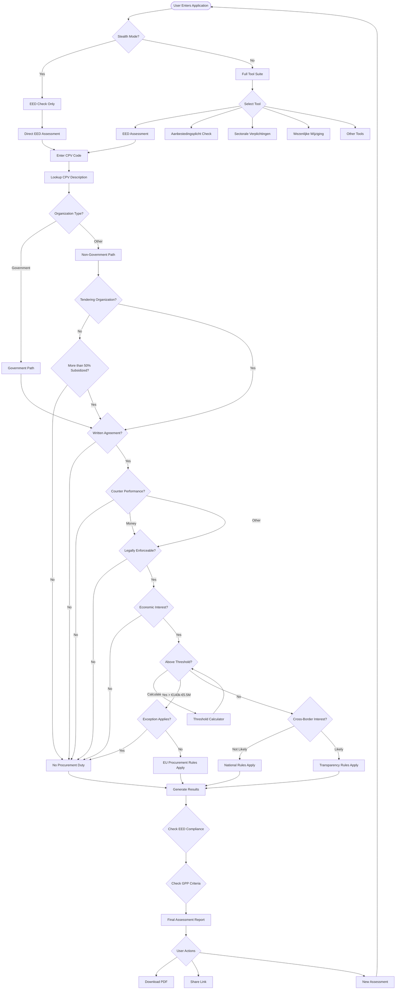
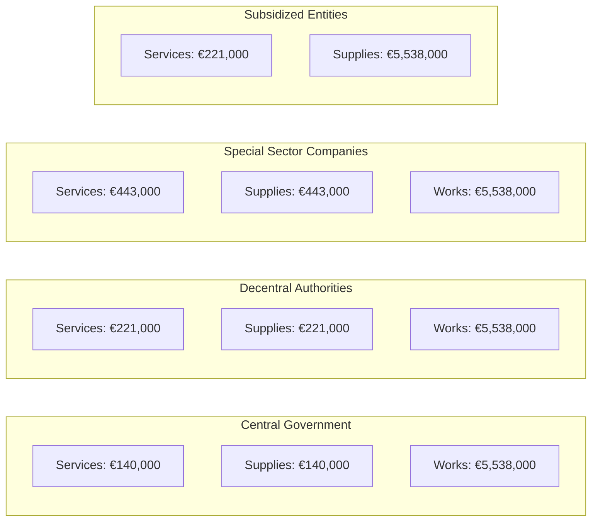
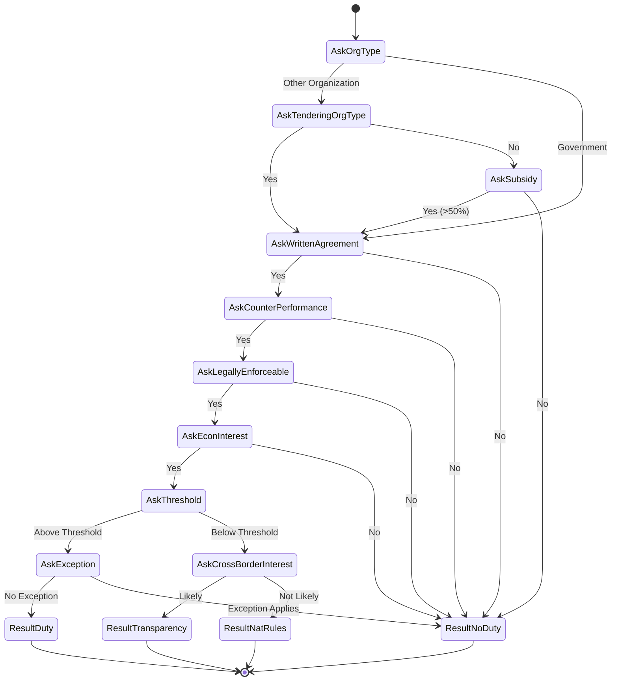
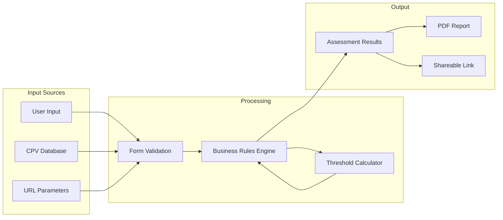

# EED Tool Application Flow Diagram

## Main Application Flow



## Threshold Values by Organization Type



## Decision Logic Flow

```mermaid
graph TD
    subgraph "Key Decision Points"
        D1[Organization Type] --> D2[Contract Characteristics]
        D2 --> D3[Threshold Evaluation]
        D3 --> D4[Compliance Requirements]
    end
    
    subgraph "Contract Characteristics"
        C1[Written Agreement]
        C2[Counter Performance]
        C3[Legal Enforceability]
        C4[Economic Interest]
    end
    
    subgraph "Compliance Outcomes"
        O1[No Procurement Duty]
        O2[National Rules]
        O3[Transparency Rules]
        O4[EU Procurement Rules]
        O5[EED Requirements]
        O6[GPP Criteria]
    end
    
    D2 --> C1 & C2 & C3 & C4
    C1 & C2 & C3 & C4 --> D3
    D4 --> O1 | O2 | O3 | O4
    O4 --> O5 & O6
```

## State Management



## Data Flow



## Key Features

1. **Stealth Mode**: Simplified interface for EED assessment only
2. **Progressive Disclosure**: Questions revealed based on previous answers
3. **State Persistence**: URL parameters maintain assessment state
4. **Legal Citations**: Hover tooltips with EU directive references
5. **Threshold Calculator**: External tool for complex calculations
6. **Multi-language**: Support for Dutch terminology
7. **Responsive Design**: Works on desktop and mobile devices